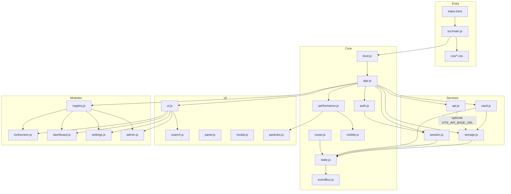
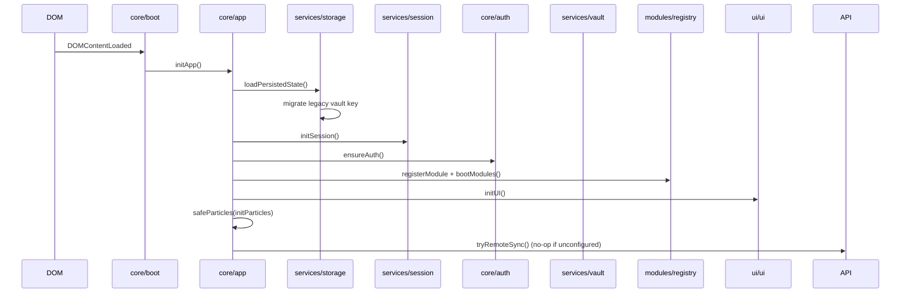

# Vault-OS Architecture

Vault-OS is a Vite-powered single-page vault UI with a layered module graph, centralized state, and one localStorage persistence key.

## Layer diagram



`api.js` exposes `tryRemoteSync()` on boot; it no-ops unless `VITE_API_BASE_URL` is set.

## Boot sequence



## State & persistence

```mermaid
erDiagram
  STATE {
    object user
    object session
    string theme
    string activeModule
    boolean locked
    array entries
  }
  LOCALSTORAGE {
    string vault_os_data
  }
  STATE ||--|| LOCALSTORAGE : snapshotFromState / loadPersistedState
```

| Field | Purpose |
|-------|---------|
| `user` | Local user stub after session start |
| `session` | `{ token, startedAt }` — auth gate |
| `theme` | CSS class `theme-*` on `body` |
| `activeModule` | `dashboard` \| `settings` \| `admin` |
| `locked` | Lockscreen visibility |
| `entries` | Vault credential cards |

## Path aliases (Vite)

| Alias | Path |
|-------|------|
| `@core` | `src/core` |
| `@services` | `src/services` |
| `@ui` | `src/ui` |
| `@modules` | `src/modules` |
| `@data` | `src/data` |
| `@utils` | `src/utils` |

## Events (eventBus)

| Event | Emitter |
|-------|---------|
| `state:change` | `setState` / `replaceState` |
| `session:start` / `session:end` | `session.js` |
| `module:boot` / `module:activate` | `registry.js` / `router.js` |
| `router:navigate` | `router.js` |
| `lock:locked` / `lock:unlocked` / `lock:denied` | `lockscreen.js` |

## Security (stabilization phase)

| Topic | Status |
|-------|--------|
| Lockscreen | Stub PIN `000000` in `lockscreen.js` |
| Encryption | Not implemented — entries stored as JSON in `localStorage` |
| Remote API | Optional; `VITE_API_BASE_URL` enables `fetchVault` / `pushVault` stubs |

## Visual assets

Styles live under `css/` (imported from `src/main.js`): `styles.css`, `themes.css`, `mobile.css`, `animations.css`, `vault-shell.css`. Lockscreen, glass cards, particles canvas (`#bgCanvas`), and dark theme are preserved. Vite scaffold `src/style.css` is not loaded.
